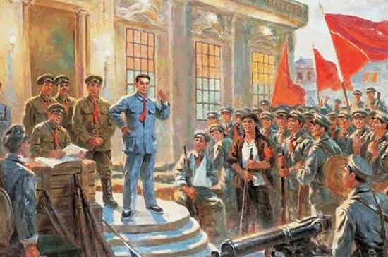

# 中国现代史概览

## 1. 辛亥革命与建立中华民国（1911年）

### 辛亥革命
辛亥革命是中国历史上的一场具有深远影响的革命，于1911年爆发。此次革命推翻了清朝统治，结束了长达两千多年的封建专制制度。这也标志着中国逐步踏上了现代化的征程。

### 孙中山与三民主义
辛亥革命的领导者孙中山提出了三民主义，包括国家独立、民主政治和民生幸福。这奠定了中华民国的基本国策。

## 2. 初建国与北洋政府（1912-1927年）

### 中华民国的成立
1912年，中华民国正式成立，标志着中国进入了民主政治的新阶段。孙中山就任临时大总统。

### 袁世凯及北洋政府
然而，后来袁世凯篡位建立北洋政府，尝试建立帝制，引发了广泛的反对。他的行为导致了政局的不稳定和内战的爆发。

## 3. 国共合作与北伐战争（1927-1937年）

### 国共合作
为了对抗北洋政府，国共两党展开合作，进行北伐战争。在这一阶段，中国共产党和中国国民党共同努力，但矛盾也逐渐加深。

### 南京国民政府

在北伐战争的胜利中，蒋中正成立南京国民政府。然而，由于意识形态的分歧，国共两党逐渐疏远，最终爆发内战。
.jpg)

## 4. 抗日战争与第二次世界大战（1937-1945年）

### 抗战爆发
1937年，日本入侵中国，引发了全面的抗日战争。中国全面投入战争，成为盟军在亚洲的主要战场之一。

### 中国的抗战
中国军民付出巨大的牺牲，与盟军共同对抗侵略者。在此期间，中国发生了淞沪会战、八年抗战等重要事件。
.jpg)

### 日本投降
1945年，二战结束，日本无条件投降，中国取得胜利。台湾由日本归还，同时爆发内战。

## 5. 内战时期与中华人民共和国的成立（1945-1949年）

### 内战爆发
在日本投降后，国共两党再次爆发内战，争夺中国的领导权。

### 中华人民共和国成立
1949年10月1日，中华人民共和国在北京宣告成立。毛泽东成为首任主席，标志着新中国的建立。

## 6. 社会主义改革与文化大革命（1949-1976年）

### 土地改革
1950年代初，共产党进行土地改革，进行社会主义改革。

### 大跃进与文化大革命
然而，在20世纪中期，中国经历了大跃进和文化大革命，带来了社会动荡和巨大的人道主义灾难。

## 7. 对外开放与改革开放（1978年至今）

### 邓小平时期
1978年，邓小平提出改革开放政策，推动中国经济社会发展。中国逐渐摆脱封闭状态，向世界敞开大门。

### 经济崛起
改革开放后，中国经济取得了巨大的成就，成为全球第二大经济体。

### 科技与现代化
中国在科技、教育和现代化建设方面取得显著进展。科技创新成为国家发展的重要引擎。
